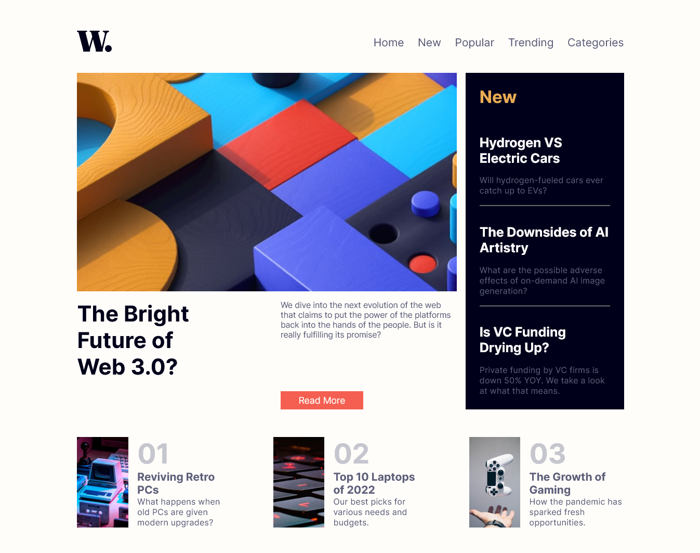

# Frontend Mentor - Blog preview card solution

This is a solution to the [News homepage challenge on Frontend Mentor](https://www.frontendmentor.io/challenges/news-homepage-H6SWTa1MFl). Frontend Mentor challenges help you improve your coding skills by building realistic projects.

## Table of contents

- [Overview](#overview)
  - [Screenshot](#screenshot)
- [My process](#my-process)
  - [Built with](#built-with)
  - [What I learned](#what-i-learned)
- [Acknowledgments](#acknowledgments)

## Overview

### Screenshot

## Built with

pure css and html

## What I learned

i learned about aspect ratio and they way to calculate and maintain it also about image as to keep at 100%. i learned a lot about grid and flex and i knew already about them but went through many different scenarios here so i am confident i know better now comapratively.I also learned abut object fit they to toggle hamburger menu using only css and to use translate if there isn't any other option to things around.I also learned about the children and parent behave when one property is applied to other.

## Acknowledgments

thanks to https://www.frontendmentor.io for providing such good material for learners to practice on.
